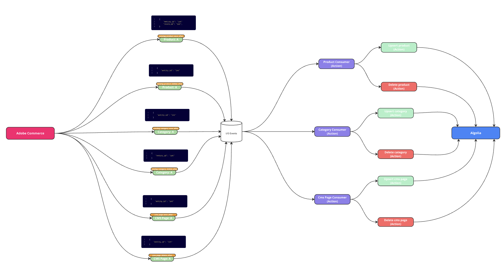
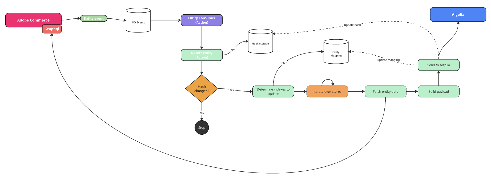
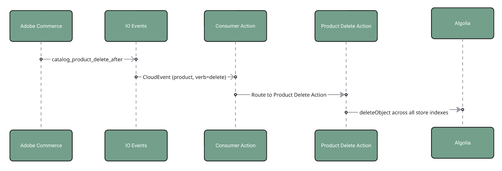

# Algolia - App Builder Integration

This project is a comprehensive event-driven and cron-based system that

1. Synchronizes product, category, cms-page from Adobe Commerce to Algolia instance.
2. The integration utilises App Builder actions triggered by Adobe I/O Events for Adobe Commerce and OpenWhisk Alarms to ensure reliable, scalable data synchronization with validation and retry mechanisms.

## Current Features

-   **Event-based sync** of products, CMS pages, and categories
    -   Create, update, and remove operations
-   **Store-to-index mapping** - Flexible configuration to map Adobe Commerce stores to Algolia indices
-   **Simple configuration** - Easy setup through environment variables
-   **Cron-based sync** - Scheduled bulk synchronization of products, categories, and CMS pages
-   **Hash-based mechanism** - Only updates entities in Algolia when data has actually changed

## Roadmap

-   **Algolia index settings management** - Automated configuration of facets, ranking, synonyms, and other index settings
-   **Admin UI for settings** - Web interface to manage all configuration currently handled via environment variables

### Table of Contents

-   [Installation & Quick Start](#installation--quick-start)
-   [High-Level Architecture](#high-level-architecture)
-   [Actions](#actions)
-   [Configuration](#configuration)
    -   [Environment Variables](#environment-variables)
    -   [Authentication: PaaS vs SaaS](#authentication-paas-vs-saas)
    -   [Configuration process](#configuration-process)
-   [Event-Driven Synchronization Overview](#event-driven-synchronization-overview)
    -   [General Upsert Flow for all entities (product, category, cms-page)](#general-upsert-flow-for-all-entities-product-category-cms-page)
    -   [Product-specific Flow](#product-specific-flow)
    -   [Category-specific Flow](#category-specific-flow)
    -   [CMS Page-specific Flow](#cms-page-specific-flow)
    -   [General Delete Flow](#general-delete-flow)
    -   [Event Routing](#event-routing)
    -   [Index and Store-Entity Mapping](#index-and-store-entity-mapping)
    -   [Hash Storage](#hash-storage)
-   [Cron-Based Synchronization Overview](#cron-based-synchronization-overview)
-   [Adobe Commerce preparation](#adobe-commerce-preparation)

## Installation & Quick Start

Follow these steps to get the application installed via Adobe Exchange and running quickly:

1. **Install via Adobe Exchange**

    - Go to `https://exchange.adobe.com/`, select "Experience Cloud" and search for **Algolia - App Builder Integration**.
    - Click the **Free** or **Install** button and follow the prompts. The application will be automatically deployed to your Adobe App Builder environment.

2. **Configure Credentials & Environment Variables**

    - In the Adobe Exchange console, click **Manage**, then open your deployed app’s environment variables/settings.
    - Set the required variables (see [Environment Variables](#environment-variables)):
        - Algolia credentials (App ID and Admin API Key as required by your setup)
        - `INDEXES_STORES_MAPPING`, `CATEGORIES_INDEXES_STORES_MAPPING`, `PAGES_INDEXES_STORES_MAPPING`
        - `STORE_WEBSITE_URL_MAPPING`, `URL_HTML_POSTFIX_ENABLED`, `DEFAULT_CATEGORY_ID`
        - `PRODUCTS_SKIPPED_ATTRIBUTES`

3. **Done! The App is Ready**

    - The app is now fully deployed and will process Adobe Commerce events automatically to synchronize entities with Algolia.
    - You can verify activity using App Builder logs and the provided debug capabilities.

## High-Level Architecture

-   Adobe I/O Events capture Commerce changes and invoke App Builder actions.
-   Builder pattern composes Algolia-ready JSON for products, categories, and CMS pages.
-   Hashing and temporary storage prevent redundant updates across store views.
-   Robust retry with exponential backoff increases reliability.

## Actions

This project includes consumer actions for routing events and specific upsert/delete actions per entity, along with full-sync utilities and configuration/helpers.

## Configuration

### Environment Variables

| Variable                            | Description                                                  |
| ----------------------------------- | ------------------------------------------------------------ |
| `INDEXES_STORES_MAPPING`            | JSON mapping stores to Algolia product indices.              |
| `CATEGORIES_INDEXES_STORES_MAPPING` | JSON mapping stores to Algolia category indices.             |
| `PAGES_INDEXES_STORES_MAPPING`      | JSON mapping stores to Algolia CMS page indices.             |
| `STORE_WEBSITE_URL_MAPPING`         | JSON mapping store IDs to website URLs and store view codes. |
| `URL_HTML_POSTFIX_ENABLED`          | Enables URL suffix handling (1/0).                           |
| `DEFAULT_CATEGORY_ID`               | Fallback category ID (default `2`).                          |
| `PRODUCTS_SKIPPED_ATTRIBUTES`       | Comma-separated product attributes to exclude from hashing.  |
| `CATEGORIES_SKIPPED_ATTRIBUTES`     | Comma-separated category attributes to exclude from hashing. |
| `PAGES_SKIPPED_ATTRIBUTES`          | Comma-separated CMS page attributes to exclude from hashing. |
| `COMMERCE_BASE_URL`                 | Base URL for Adobe Commerce REST API.                        |
| `COMMERCE_CONSUMER_KEY`             | OAuth1 Consumer Key (PaaS only).                             |
| `COMMERCE_CONSUMER_SECRET`          | OAuth1 Consumer Secret (PaaS only).                          |
| `COMMERCE_ACCESS_TOKEN`             | OAuth1 Access Token (PaaS only).                             |
| `COMMERCE_ACCESS_TOKEN_SECRET`      | OAuth1 Access Token Secret (PaaS only).                      |
| `OAUTH_CLIENT_ID`                   | IMS OAuth Client ID (SaaS only).                             |
| `OAUTH_CLIENT_SECRET`               | IMS OAuth Client Secret (SaaS only).                         |
| `OAUTH_SCOPES`                      | IMS OAuth Scopes (SaaS only, comma-separated).               |
| `OAUTH_HOST`                        | IMS OAuth Host (optional).                                   |

**Notes:**

-   Only set the variables relevant to your Adobe Commerce deployment (PaaS or SaaS). Leave the others blank or unset.

### Authentication: PaaS vs SaaS

> **Note:** When configuring the `COMMERCE_BASE_URL` environment variable, the format differs between PaaS and SaaS:
>
> **For PaaS (On-Premise/Cloud):**
>
> -   Must include your base site URL + `/rest/` suffix
> -   Example: `https://[environment-name].us-4.magentosite.cloud/rest/`
>
> **For SaaS:**
>
> -   Must be the REST API endpoint provided by Adobe Commerce
> -   Example: `https://na1-sandbox.api.commerce.adobe.com/[tenant-id]/`
>
> Make sure to use your actual environment name or tenant ID in the URL. The examples above use placeholder values.

#### Supported Auth Types

With the new announcement of **Adobe Commerce as a Cloud Service** (ACCS), requests to Commerce will now use different authentication strategies depending on the flavor you're using:

-   If you're using the traditional Adobe Commerce Platform (PaaS) offering, you'll need to authenticate via OAuth1, as before.
-   If you're using the new cloud service (SaaS) offering, you'll need to authenticate your requests using [Adobe Identity Management System (IMS)](https://experienceleague.adobe.com/en/docs/experience-manager-learn/foundation/authentication/adobe-ims-authentication-technical-video-understand).

#### [PaaS] Commerce OAuth1 - Configure a new Integration in Commerce

Configure a new Integration to secure the calls to Commerce from App Builder using OAuth by following these steps:

-   In the Commerce Admin, navigate to System > Extensions > Integrations.
-   Click the `Add New Integration` button. The following screen displays:
    
-   Give the integration a name. The rest of the fields can be left blank.
-   Select API on the left and grant access to all the resources.
    
-   Click Save.
-   In the list of integrations, activate your integration.
-   To configure the connector, you will need the integration details (consumer key, consumer secret, access token, and access token secret).

Set the following environment variables in your deployment environment:

-   `COMMERCE_CONSUMER_KEY`
-   `COMMERCE_CONSUMER_SECRET`
-   `COMMERCE_ACCESS_TOKEN`
-   `COMMERCE_ACCESS_TOKEN_SECRET`

#### [SaaS] IMS OAuth - Add the OAuth Server to Server credentials

Configure a new IMS OAuth Server to Server following this [documentation](https://developer.adobe.com/developer-console/docs/guides/authentication/ServerToServerAuthentication/implementation/#setting-up-the-oauth-server-to-server-credential/)

Set the following environment variables in your deployment environment:

-   `OAUTH_CLIENT_ID` (your client ID)
-   `OAUTH_CLIENT_SECRET` (your client secret)
-   `OAUTH_SCOPES` (comma-separated, e.g. `scope1,scope2`)

Optional:

-   `OAUTH_HOST` (default: `https://ims-na1.adobelogin.com`)

#### How to use one or another?

The project is designed to work with both offerings, but only one of them at the same time. By default (and to prevent breaking changes), the SaaS offering is opt-in, which means that you will need to explicitly configure it in order to start using it. **OAuth1** will be the first authentication mechanism tried before **IMS**.

-   If you want to use PaaS, follow the steps above and make sure your environment variables `COMMERCE_XXXX` are set correctly.
-   If you want to use SaaS, follow the steps above and make sure the environment variables `COMMERCE_XXXX` are **NOT SET** (blank) or deleted from your deployment environment.

### Configuration process

This app reads configuration from environment variables. Here’s how to set the most important ones correctly.

1. INDEXES_STORES_MAPPING (products)

-   Purpose: Maps Adobe Commerce store IDs to Algolia product index names. Supports a single index string or an array of indices.
-   Fields:
    -   stores: Object keyed by storeId (string) → index name (string) or list of index names (string[])
    -   defaultPrefix (optional): Fallback prefix used when a store ID is not explicitly mapped
    -   fallbackToPrefix (optional, boolean): When true, uses defaultPrefix + storeId if a direct mapping is missing
-   Example (single index per store):

```
INDEXES_STORES_MAPPING='{"stores": {"1": "products_default", "6": "products_poland"}, "defaultPrefix": "products", "fallbackToPrefix": true}'
```

-   Example (multiple indices per store):

```
INDEXES_STORES_MAPPING='{"stores": {"1": ["products_all", "products_default"], "6": ["products_all", "products_poland"]}}'
```

2. CATEGORIES_INDEXES_STORES_MAPPING (categories)

-   Same shape and rules as INDEXES_STORES_MAPPING, but for category indices.

```
CATEGORIES_INDEXES_STORES_MAPPING='{"stores": {"1": "categories_default", "6": "categories_poland"}, "defaultPrefix": "categories", "fallbackToPrefix": true}'
```

3. PAGES_INDEXES_STORES_MAPPING (CMS pages)

-   Same shape and rules as INDEXES_STORES_MAPPING, but for CMS page indices.

```
PAGES_INDEXES_STORES_MAPPING='{"stores": {"1": "pages_default", "6": "pages_poland"}, "defaultPrefix": "pages", "fallbackToPrefix": true}'
```

4. STORE_WEBSITE_URL_MAPPING (store context)

-   Purpose: Defines website URL and GraphQL store view code per Commerce store ID. The first URL is used to build the GraphQL endpoint; the store_view_code is sent as the `Store` header.
-   Fields:
    -   stores: Object keyed by storeId (string) → { url: string, store_view_code: string }
-   Example:

```
STORE_WEBSITE_URL_MAPPING='{"stores": {"1": {"url": "https://your-site/", "store_view_code": "default"}, "6": {"url": "https://your-site-pl/", "store_view_code": "pl"}}}'
```

5. URL_HTML_POSTFIX_ENABLED (URLs)

-   Purpose: Controls whether product/page URLs include ".html" suffix when built.
-   Values: 1 (enabled) or 0 (disabled)

```
URL_HTML_POSTFIX_ENABLED=1
```

6. DEFAULT_CATEGORY_ID (products)

-   Purpose: Fallback root category ID for products when none is available.
-   Default: 2

```
DEFAULT_CATEGORY_ID=2
```

7. PRODUCTS_SKIPPED_ATTRIBUTES, CATEGORIES_SKIPPED_ATTRIBUTES, PAGES_SKIPPED_ATTRIBUTES (hash stability)

-   Purpose: Attributes to ignore when generating hashes to prevent unnecessary updates (e.g., volatile fields).
-   Format: Comma-separated list (no spaces)

```
PRODUCTS_SKIPPED_ATTRIBUTES='image,small_image,thumbnail_image,options_container,custom_design_to,msrp_display_actual_price_type,tax_class_id,gift_message_available,gift_wrapping_available,activity,price,custom_design_to,special_to_date,cost,tier_price,is_returnable'
CATEGORIES_SKIPPED_ATTRIBUTES='updated_at,form_key'
PAGES_SKIPPED_ATTRIBUTES='form_key'
```

Notes

-   Store IDs are numeric in Commerce but must be JSON keys as strings in these variables.
-   Multiple indices per store let you fan-out updates to several Algolia indices (e.g., "products_all" and a store-specific index).
-   If a store is missing from `stores` and `fallbackToPrefix=true`, the index resolves to `${defaultPrefix}_${storeId}`.

### Logging and Observability (Optional)

-   **`LOG_LEVEL`**: Controls logging verbosity (debug, info, warn, error). Default is 'info'.
-   **`NEW_RELIC_LICENSE_KEY`**: Enables New Relic monitoring and observability for the integration.
-   **`NEW_RELIC_OTLP_ENDPOINT`**: (Optional) If set, enables automatic forwarding of logs and tracing data to New Relic via OpenTelemetry. Must be used together with `NEW_RELIC_LICENSE_KEY`. Example: `https://otlp.eu01.nr-data.net:443`

#### OpenTelemetry Integration

This integration supports OpenTelemetry for distributed tracing and log forwarding. When `NEW_RELIC_OTLP_ENDPOINT` is set (typically to `https://otlp.eu01.nr-data.net:443`) and a valid `NEW_RELIC_LICENSE_KEY` is provided, all logs and traces are automatically forwarded to New Relic. This enables advanced observability, distributed tracing, and log analytics in your New Relic dashboard.

**Example configuration:**

| Variable Name             | Required | Description                                                       | Example Value                       |
| ------------------------- | -------- | ----------------------------------------------------------------- | ----------------------------------- |
| `NEW_RELIC_LICENSE_KEY`   | No       | New Relic license key for observability.                          | `your_new_relic_license_key`        |
| `NEW_RELIC_OTLP_ENDPOINT` | No       | New Relic OTLP endpoint for OpenTelemetry log/tracing forwarding. | `https://otlp.eu01.nr-data.net:443` |

**How it works:**

-   When both variables are set, the integration will automatically forward all supported logs and traces to New Relic using the OTLP protocol.
-   No additional code changes are required; instrumentation is handled internally via OpenTelemetry.
-   For more details, see the [Technical Documentation](docs/TECHNICAL_DOCUMENTATION.md#opentelemetry-and-new-relic-integration).

## Event-Driven Synchronization Overview

The integration follows a multi-stage event-driven process designed for reliability and data consistency.

### General Upsert Flow for all entities (product, category, cms-page)

1. **Event Triggering**: Adobe Commerce emits events (e.g., product created, updated, deleted) which are captured by Adobe I/O Events.
2. **Action Invocation**: These events trigger specific App Builder actions that handle the synchronization logic.
3. **Event Data Validation**: The action first checks if the event data contains sufficient information (like SKU) to proceed.
4. **Data Processing**: The actions process the event data, perform necessary transformations, and prepare it for Algolia.
5. **Algolia Update**: The processed data is sent to Algolia to update the respective indices, whose relations are configured as json data in .env file.
6. **Prevent redundant Updates**: The system checks if the data has changed before making updates to avoid unnecessary operations. We are using temp storage to store the last known state of the data.
7. **Error Handling and Retries**: If an action fails, it is retried up to 100 times with exponential backoff to ensure data consistency.



### Product-specific Flow

The product sync follows the general flow with additional steps under Data Processing:

-   **Store definition**: The action determines the store context from the event data to use correct graphql endpoint on the next stage. The store code-to-url mapping is configured as json data in .env file.
-   **GraphQL Query**: The action fetches detailed product information using GraphQL queries because data from events may be incomplete.
-   **Hash Comparison**: A hash of the product data from Graphql response is generated and compared with the last known hash to determine if an update is necessary.
-   **Custom Attributes Handling**: The action processes custom attributes, ensuring they are correctly formatted for Algolia. The skipped attributes are configured as a comma-separated list in .env file.



```
STORE_WEBSITE_URL_MAPPING='{"stores": {"0": {"url": "https://ac-playground-core-dya6atq-z3ek236yy2yv2.eu-4.magentosite.cloud/", "store_view_code": "default"}, "1": {"url": "https://ac-playground-core-dya6atq-z3ek236yy2yv2.eu-4.magentosite.cloud/", "store_view_code": "default"}}}'
```

### Category-specific Flow

Based on the incoming event and the resolved store configuration, the action:

-   Fetches the category via Adobe Commerce REST API
-   Builds the Algolia payload using the builder pattern
-   Generates and compares the hash to detect changes
-   Updates the mapped Algolia index(es) only when the hash differs

### CMS Page-specific Flow

Based on the incoming event and the resolved store configuration, the action:

-   Fetches the CMS page via Adobe Commerce REST API
-   Builds the Algolia payload using the builder pattern
-   Generates and compares the hash to detect changes
-   Updates the mapped Algolia index(es) only when the hash differs

### General Delete Flow

1. **Event Triggering**: Adobe Commerce emits delete events (e.g., product deleted) which are captured by Adobe I/O Events. Or the delete action is triggered as part of the upsert flow when it detects that the entity is disabled or not visible.
2. **Action Invocation**: These events trigger specific App Builder actions that handle the deletion logic.
3. **Data Validation**: The action checks if the event data contains sufficient information (like SKU) to proceed.
4. **Data Processing**: The actions process the event data to identify the entity to be deleted in Algolia.
5. **Algolia Deletion**: The action sends a request to Algolia to remove the respective entry from the index.
6. **Hash Cleanup**: The action removes the stored hash for the deleted entity to free up space and maintain data integrity.



### Event Routing

Adobe I/O Events receives the event and invokes the App Builder project. Consumer Action for each entity reads the event type and routes to specific Upsert or Delete Action depending on the event type and is_active (enabled/visible) flag in the payload.

### Index and Store-Entity Mapping

To maintain integrity we have implemented persistent storage to store the consistent mapping between stores and entities. We're updating this mapping during each upsert and delete operation. This ensures that we always have an accurate record of which entities belong to which stores, facilitating efficient data management and retrieval.

### Hash Storage

To prevent redundant updates to Algolia, we are storing the last known hash of each entity. Before performing an update, we compare the newly generated hash with the stored hash. If they match, the update is skipped, ensuring that only actual changes trigger updates in Algolia. This mechanism optimizes performance and reduces unnecessary operations.
Hashes correspond to combination of entity SKU/ID and store ID to ensure uniqueness across different store views.

## Cron-Based Synchronization Overview

The app supports a periodic, cron-based full-sync to (re)build Algolia indices from Adobe Commerce in bulk.

What it does

-   Iterates through configured stores (from your environment variables)
-   For each entity type (products, categories, CMS pages):
    -   Fetches data from Adobe Commerce (REST/GraphQL as implemented per entity)
    -   Builds Algolia payloads using the same builder pattern as event-driven
    -   Compares hashes to skip unchanged records
    -   Pushes updates to the mapped Algolia index(es)

How it runs

-   Scheduled by an OpenWhisk Alarm (configured in the project) to run on an hourly interval
-   Uses the same configuration you set in Environment Variables (index mappings, store website URLs, skipped attributes)

Notes

-   Full-sync complements event-driven updates; events keep indices fresh, while cron full-sync ensures consistency and allows bulk rebuilding when needed.

## Adobe Commerce preparation

In order to enable event-driven synchronization, you need to set up Adobe I/O Events module for Adobe Commerce.
Follow the official documentation to add new event provider connected to your App Builder project.
https://developer.adobe.com/commerce/extensibility/starter-kit/integration/create-integration/#:~:text=Complete%20the%20Adobe%20Commerce%20eventing%20configuration
Use the provider ID and instance ID from the onboarding step.
The event provider in Magento can also be setup as an additional provider under `Events -> Event Providers` Menu.
