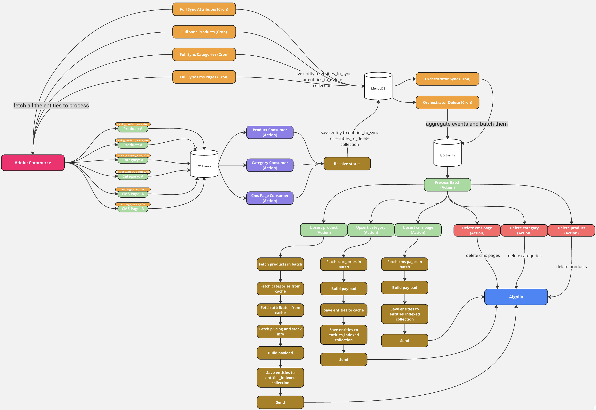

# Algolia - App Builder Integration

This project is a comprehensive event-driven system that synchronizes products, categories, and CMS pages from Adobe Commerce to Algolia search indices using Adobe I/O Events and Runtime Actions.

> **📖 Looking to install, configure, and operate the app?** See the **[User Guide](docs/user-guide/README.md)** — a step-by-step walkthrough for merchants and store administrators, no developer or command-line knowledge required. The rest of this README covers architecture and developer-level detail.

## Current Features

- **Event-based sync** of products, CMS pages, and categories with batch processing
- **MongoDB queue system** for reliable, scalable event processing
- **Store-to-index mapping** - Flexible configuration to map Adobe Commerce stores to Algolia indices
- **Hash-based change detection** - Only updates entities in Algolia when data has actually changed
- **Automatic retry mechanism** - Failed operations are retried with configurable limits
- **Full sync support** - Scheduled bulk synchronization with orphan cleanup
- **Admin UI for settings** - Web interface to manage configuration
- **Algolia index settings management** - Automated configuration of facets, ranking, synonyms, and other index settings

### Table of Contents

- [Installation & Quick Start](#installation--quick-start)
- [High-Level Architecture](#high-level-architecture)
- [Configuration](#configuration)
    - [App Management Configuration](#app-management-configuration)
    - [Authentication: PaaS vs SaaS](#authentication-paas-vs-saas)
    - [Logging and Observability](#logging-and-observability-optional)
- [Event-Driven Synchronization Overview](#event-driven-synchronization-overview)
    - [Stage 1: Commerce Events](#stage-1-commerce-events)
    - [Stage 2: Commerce Event Reception](#stage-2-commerce-event-reception)
    - [Stage 3: Batch Aggregation and Publishing](#stage-3-batch-aggregation-and-publishing)
    - [Stage 4: Batch Processing](#stage-4-batch-processing)
    - [Entity-Specific Processing](#entity-specific-processing)
- [Queue System](#queue-system)
    - [MongoDB Collections](#mongodb-collections)
    - [Status Management](#status-management)
    - [Retry Mechanism](#retry-mechanism)
- [Full Sync Process](#full-sync-process)
- [Hash-Based Change Detection](#hash-based-change-detection)
- [Configuration Process](#configuration-process)
- [Adobe Commerce preparation](#adobe-commerce-preparation)

## Installation & Quick Start

Follow these steps to get the application installed via Adobe Exchange and running quickly:

1. **Install via Adobe Exchange**
    - Go to `https://exchange.adobe.com/`, select "Experience Cloud" and search for **Algolia - App Builder Integration**.
    - Click the **Free** or **Install** button and follow the prompts.
    - Create an **App Builder environment** for the app to deploy into. This request is approved by your org admin.

2. **Associate and install on your instance**
    - In **App Management** (ACCS Console or Commerce Admin), select the app, choose the workspace (the environment from step 1), and click **Associate**.
    - Click **Install** to set up the Commerce events, the Admin UI dashboard, and the database.

3. **Configure Credentials via App Management**
    - Open the App Management settings page and click **Configure**.
    - Set the required values (see [App Management Configuration](#app-management-configuration)):
        - Commerce URL and authentication credentials (PaaS or SaaS)
        - Algolia credentials (App ID and Admin API Key)

4. **Initialize and configure indexing**
    - Open **Apps → Algolia Configuration** in Commerce Admin and run the one-click initialization, then configure stores, attributes, and run a full sync.
    - For the full step-by-step walkthrough, see the **[User Guide](docs/user-guide/README.md)**.

## High-Level Architecture

The system uses a multi-stage event flow pattern with MongoDB-based queues for reliable processing:

1. **Adobe Commerce Events** → Commerce emits events when entities are created, updated, or deleted
2. **Commerce Consumer Actions** → Receive events and insert entities into MongoDB queue collections
3. **Scheduled Orchestrators** → Aggregate pending entities and publish batch events to Adobe I/O Events
4. **Batch Processor Actions** → Handle actual processing asynchronously (fetch data, transform, sync to Algolia)

**MongoDB Collections:**

- `entities_to_sync` - Unified queue for both upsert and delete operations, distinguished by `operation_type` field
- `entities_indexed` - Tracks what's currently in Algolia (source of truth)
- `entities_cache` - Stores derived data (categories, attributes) used during entity building

**Key Characteristics:**

- Entity-agnostic queue design supporting products, categories, and CMS pages
- Automatic deduplication of multiple events for the same entity
- Hash-based change detection to skip unchanged entities
- Automatic recovery of stuck processing items
- Horizontal scaling via Adobe I/O Runtime auto-scaling

## Configuration

### App Management Configuration

Commerce credentials are managed through the [Adobe Commerce App Management](https://developer.adobe.com/commerce/extensibility/app-management/) system. After installation, configure the following values in the App Management settings page:

| Setting                       | Description                                    |
| ----------------------------- | ---------------------------------------------- |
| `Commerce URL`                | Base URL for Adobe Commerce REST API.          |
| `Algolia App Id`              | Your Algolia Application ID.                   |
| `Algolia Admin API Key`       | Your Algolia Admin API Key.                    |
| `New Relic License Key`       | (Optional) License key for New Relic observability. |
| `New Relic OTLP Endpoint`     | (Optional) OTLP endpoint for New Relic (default: `https://otlp.nr-data.net:4318`). |

These values are fetched at runtime from the App Management system and do not need to be set as environment variables.

> **Commerce authentication requires no configuration here.** Calls to Commerce are
> authenticated via Adobe IMS (OAuth Server-to-Server) for **both** PaaS and ACCS/SaaS.
> The IMS credentials are injected automatically from the App Builder project's
> OAuth Server-to-Server credential — there are no env variables or App Management settings
> to fill in. See [Authentication: PaaS vs SaaS](#authentication-paas-vs-saas) below.

### Authentication: PaaS vs SaaS

> **Note:** When configuring the `Commerce URL`, the format differs between PaaS and SaaS:
>
> **For PaaS (On-Premise/Cloud):**
>
> - Must include your base site URL + `/rest/` suffix
> - Example: `https://[environment-name].us-4.magentosite.cloud/rest/`
>
> **For SaaS:**
>
> - Must be the REST API endpoint provided by Adobe Commerce
> - Example: `https://na1-sandbox.api.commerce.adobe.com/[tenant-id]/`
>
> Make sure to use your actual environment name or tenant ID in the URL. The examples above use placeholder values.

#### Supported Auth Types

Requests to Commerce are authenticated via **Adobe Identity Management System (IMS)** for
**both** the traditional Adobe Commerce Platform (PaaS) and the new **Adobe Commerce as a
Cloud Service** (ACCS/SaaS) offerings. The legacy Commerce integration credentials (OAuth1
consumer key/secret and access token/secret) are **no longer used**.

The flavor (PaaS vs SaaS) is auto-detected from the `Commerce URL`, and the same IMS
credentials are used either way.

#### IMS OAuth Server-to-Server credentials

No manual credential configuration is needed. The runtime actions declare the
`include-ims-credentials: true` annotation, so the App Builder platform automatically injects
the project's **OAuth Server-to-Server** credential (client ID/secret, technical account, org
ID, and scopes) into the actions at runtime. The OAuth Server-to-Server credential is created
as part of the standard Adobe Developer Console project/workspace setup
([documentation](https://developer.adobe.com/developer-console/docs/guides/authentication/ServerToServerAuthentication/implementation/#setting-up-the-oauth-server-to-server-credential/)).

#### [PaaS] Enable IMS on the Commerce instance

For PaaS, the Commerce instance must have **Adobe IMS for Adobe Commerce** configured so it
can accept IMS-issued tokens, and the technical account must be granted API access:

1. Configure the Adobe IMS integration in Commerce Admin — follow
   [Configure the Adobe Identity Management Service (IMS) integration](https://experienceleague.adobe.com/en/docs/commerce-admin/start/admin/ims/adobe-ims-config).
2. Add the OAuth Server-to-Server **technical account email**
   (`<id>@techacct.adobe.com`) as an Admin user in Commerce
   (**System > Permissions > All Users**) and assign a role with the API permissions the
   integration needs.

> SaaS/ACCS instances already include IMS configuration, so no extra Commerce-side setup is
> required beyond the OAuth Server-to-Server credential above.

### Logging and Observability (Optional)

This integration supports OpenTelemetry for distributed tracing and log forwarding to New Relic. To enable it, set the `New Relic License Key` and optionally the `New Relic OTLP Endpoint` in the [App Management Configuration](#app-management-configuration).

When both values are configured, all logs and traces are automatically forwarded to New Relic using the OTLP protocol. No additional code changes are required; instrumentation is handled internally via OpenTelemetry.

## Event-Driven Synchronization Overview

The integration follows a multi-stage event-driven process designed for reliability and data consistency.

### Stage 1: Commerce Events

Adobe Commerce emits events when entities are created, updated, or deleted:

**Products:**

- `observer.catalog_product_save_after` - Product created or updated
- `observer.catalog_product_delete_commit_after` - Product deleted

**Categories:**

- `observer.catalog_category_save_after` - Category created or updated
- `observer.catalog_category_delete_after` - Category deleted

**CMS Pages:**

- `observer.cms_page_save_after` - CMS page created or updated
- `observer.cms_page_delete_after` - CMS page deleted

### Stage 2: Commerce Event Reception

Commerce consumer actions receive events from Adobe Commerce via Adobe I/O Events.

When an event arrives:

1. The consumer validates the event via retry count validation (maximum 5 retries per event)
2. Routes to the appropriate upsert or delete handler based on event type
3. Extracts entity data (entity_id, entity_type)
4. Resolves store configurations to determine which stores need the entity synced
5. For default store (store_id=0) events, entries are created for ALL configured store views
6. Inserts entities into the unified `entities_to_sync` queue with status `PENDING`

- **For upsert events (save_after):** Entities are inserted with `operation_type: "upsert"`
- **For delete events (delete_after):** Entities are inserted with `operation_type: "delete"`

### Stage 3: Batch Aggregation and Publishing

The batch-event-system orchestrator actions run periodically (configured schedule).

The orchestrator performs:

1. **Query Pending Entities with Deduplication**
    - Queries the unified `entities_to_sync` collection
    - Filters by status (PENDING, RETRY with retry_attempts < 5, or PROCESSING with created_at older than 1 hour)
    - Filters by created_at with a 5-second cutoff to prevent race conditions
    - Groups by (entity_id, store_id, entity_type) to deduplicate multiple events
    - Captures the **last** `operation_type` per group (by `created_at` order) — **last operation wins**
    - Collects all MongoDB \_ids for batch status updates

2. **Split by Operation Type** - Separates aggregated entities into upsert and delete groups based on `operation_type`

3. **Mark as Processing** - Updates all row_ids to status `PROCESSING` to prevent duplicate processing

4. **Publish to Adobe I/O Events** - Publishes sync batch events for upsert entities and delete batch events for delete entities:
    - `algolia_integration.internal.{entity}.batch.sync`
    - `algolia_integration.internal.{entity}.batch.delete`

### Stage 4: Batch Processing

Internal batch consumer actions are automatically triggered by Adobe I/O Events.

**Sync Processing Flow:**

1. Receive batch event with batch_id, entities array, and row_ids
2. Fetch entity data from Adobe Commerce REST API
3. Categorize entities:
    - **Returned by API**: Entity is visible/enabled → sync to Algolia
    - **Not returned by API**: Check `entities_indexed` table
        - If previously indexed → add to `entities_to_sync` with `operation_type: "delete"` for cleanup
        - If never indexed → skip (nothing to delete)
4. Build entity payload for Algolia format
5. Hash-based change detection - skip unchanged entities
6. Send to Algolia using saveObjects batch API
7. Update `entities_indexed` tracking table
8. Update queue status to SUCCESS or handle failures

**Delete Processing Flow:**

1. Receive batch event with entities to delete
2. Delete from Algolia using deleteObjects
3. Remove from `entities_indexed` table
4. Remove stored hashes
5. Update queue status

### Entity-Specific Processing

**Products** (most complex):

- Data from Products REST API, `entities_cache` (categories, attributes), and pricing endpoints
- Deletion criteria: NOT_VISIBLE_INDIVIDUALLY or DISABLED status
- Partial batch processing for SaaS deployments when data isn't immediately available

**Categories:**

- Data from Categories REST API
- Categories are saved to `entities_cache` after successful sync for product building

**CMS Pages:**

- Data from CMS Pages REST API
- Deletion based on enabled/active status

## Queue System

### MongoDB Collections

| Collection         | Purpose                                                                                      |
| ------------------ | -------------------------------------------------------------------------------------------- |
| `entities_to_sync` | Unified queue for both upsert and delete operations, distinguished by `operation_type` field |
| `entities_indexed` | Tracks entities currently in Algolia (source of truth)                                       |
| `entities_cache`   | Stores derived data (categories, attributes) for entity building                             |

### Status Management

| Status       | Description                                 |
| ------------ | ------------------------------------------- |
| `PENDING`    | Initial state, waiting to be processed      |
| `PROCESSING` | Currently being processed by a batch action |
| `SUCCESS`    | Successfully completed                      |
| `FAILED`     | Failed after maximum retry attempts         |
| `RETRY`      | Needs to be retried                         |

### Retry Mechanism

**Event-Level Retries:**

- Maximum 5 retries per Adobe Commerce event
- Events exceeding retry count are skipped with a warning

**Queue-Level Retries:**

- Each queue item tracks retry_attempts
- On failure, status changes to RETRY and retry_attempts increments
- After 5 attempts, status changes to FAILED

**Stuck Processing Recovery:**

- Items in PROCESSING status for longer than 1 hour are automatically included in the next batch
- Provides self-healing without manual intervention

## Full Sync Process

Full sync handles initial catalog indexing or periodic complete reindexing.

**Orchestration Flow:**

1. Full-sync action is invoked for an entity type (product, category, cms-page)
2. Loads all store configurations
3. For each store:
    - **Sync Phase**: Fetches entities from Commerce using paginated REST API calls
        - Products: Filters by status (Enabled) and visibility
        - Categories: Filters by active status
        - CMS pages: Filters by active status
    - Inserts entities into `entities_to_sync` queue with `operation_type: "upsert"`
    - **Cleanup Phase**: Handles orphaned entities
        - Gets all currently indexed entities from `entities_indexed`
        - Compares with fetched entities to find orphans
        - Queues orphaned entities to `entities_to_sync` with `operation_type: "delete"`
4. Returns counts of synced and queued for deletion

**Attribute Handling:**

- Attributes are processed directly into `entities_cache` (not queued)
- Provide labels for select/multiselect product attribute values
- Refreshed every hour via scheduled full-sync

## Hash-Based Change Detection

The system implements SHA-256 hash comparison to optimize sync operations:

1. **Compute Hash** - Generate deterministic hash of each Algolia object payload
2. **Compare** - Check against previously stored hash
3. **Sync Decision**:
    - Hash changed or new: Sync to Algolia
    - Hash unchanged: Skip (no API call needed)
4. **Persist** - Save new hashes only after successful Algolia sync
5. **Cleanup** - Remove hashes when entities are deleted from Algolia

This significantly reduces unnecessary Algolia API calls when entities haven't actually changed.

## Configuration Process

This app provides a comprehensive configuration interface through the Algolia Settings admin page in Adobe Commerce. The interface is built with Adobe React Spectrum components for a consistent user experience with the Adobe Commerce admin.

Configuration data is stored in App Builder's persistent storage in JSON format.

### Navigation Structure

The configuration page is included in the standard Magento menu via the Admin UI SDK menu extension point. It contains a tabbed interface with five main pages:

1. **Stores** - Index and URL mapping configuration
2. **Products** - Product indexing configuration
3. **Categories** - Category indexing configuration
4. **Full Sync** - Manual synchronization triggers
5. **Queue Monitor** - Processing queue inspection

> **General settings** (Enable URL HTML Postfix, Display Out of Stock Products) are no longer configured here. They are managed through Adobe App Management as `businessConfig` fields in `app.commerce.config.ts` and edited per scope (global / website / store view) in **Commerce Admin**. See the [General Settings](#general-settings-app-management) section below.

### Store-Specific Configuration

Products and Categories settings support per-store configuration. When a different store is selected, the form fields update to reflect the settings specific to that store.

- **Default Store**: Edit global settings that apply to all stores unless overridden
- **Use Default Configuration checkbox**: When checked, the store inherits settings from Default configuration. When unchecked, you can customize settings specifically for that store.

---

### Stores Page

Manages Algolia index configurations per store and maps store websites to URLs.

**Algolia Indexes Configuration**

Three subsections for configuring index names and enabling/disabling sync per store:

- **Products Index**: Configure product index names and enable/disable toggle per store
- **Categories Index**: Configure category index names and enable/disable toggle per store
- **CMS Pages Index**: Configure CMS page index names (note: SaaS version doesn't support CMS pages)

Each subsection displays:

- Store name and store code
- Index name (editable)
- Enabled checkbox to enable/disable syncing for that store

**Store Website URL Mapping**

Maps each store to its website URL for fetching correct product and category data during import processes:

- Store View Code (read-only)
- Store Group Code (read-only)
- Website Code (read-only)
- URL field (editable)

---

### General Settings (App Management)

Global configuration settings that affect product search behavior. These are defined as `businessConfig` fields in `app.commerce.config.ts` and edited in **Commerce Admin**, not in this dashboard. App Management resolves each value at the selected scope (global → website → store → store view) with native inheritance, replacing the former per-store "Use Default Configuration" toggle.

**Available Settings:**

- **Enable URL HTML Postfix** (`url-html-postfix-enabled`): Append the `.html` suffix to product, category and CMS page URLs sent to Algolia
- **Display Out of Stock Products** (`display-out-of-stock-products`): Keep out-of-stock products in the Algolia index instead of removing them
- **Adobe Commerce as a Cloud Service (SaaS)** (`is-saas-version`): Enable when the Commerce backend is ACCS/SaaS. Switches product price and stock retrieval to the SaaS GraphQL API and disables CMS page index syncing. This replaces the former `IS_SAAS_VERSION` environment variable; set it once at the **global** scope.

At runtime the per-store-view flags are read via `actions-src/utils/config/general-config.ts`, and the deployment-wide SaaS flag via `actions-src/utils/config/saas-config.ts` (both using `@adobe/aio-commerce-lib-config`).

---

### Products Page

Configure product searchability, facets, sorting, and ranking for Algolia. All sections support per-store configuration.

**1. Attributes Configuration**

Determines which product attributes are used in Algolia indexes. For each attribute you can configure:

- **Searchable**: Whether the attribute is searchable
- **Ordered**: Whether the attribute is used for sorting (Unordered/Ordered)
- **Retrievable**: Whether the attribute is returned in search results

Recommendations:

- Include descriptive attributes (`name`, `description`, `brand`) and identifying data (`SKU`, model numbers)
- Exclude display-only attributes (`URLs`, `images`, `prices`) and informational flags

**2. Facets Configuration**

Configure product facets/filters for the search interface. For each facet you can configure:

- **Attribute**: The product attribute to use as a facet
- **Facet Type**: Price Range, Conjunctive (AND logic), Disjunctive (OR logic), or Slider
- **Label**: Display name for the frontend
- **Searchable**: Searchable, Filter Only, or Not Searchable
- **Create Query Rule**: Yes/No
- **Number of Values**: Maximum number of facet values to display

**3. Sorting Configuration**

Create custom sorting options for product listings. For each sort option you can configure:

- **Attribute**: The product attribute to sort by
- **Sort Direction**: Ascending or Descending
- **Label**: Display name for the sort option
- **Enable Virtual Replica**: Yes/No

**4. Ranking Configuration**

Create custom ranking rules to surface your best products. Algolia applies custom ranking as a tie-breaker after its default ranking strategy. For each ranking rule you can configure:

- **Attribute**: The product attribute to rank by
- **Order**: Ascending or Descending

---

### Categories Page

Configure category searchability and ranking for Algolia. Supports per-store configuration.

**1. Attributes Configuration**

Determines which category attributes are used in Algolia indexes. For each attribute you can configure:

- **Searchable**: Whether the attribute is searchable
- **Ordered**: Whether the attribute is used for sorting
- **Retrievable**: Whether the attribute is returned in search results

**2. Ranking Configuration**

Create custom ranking rules for categories. For each ranking rule you can configure:

- **Attribute**: The category attribute to rank by
- **Order**: Ascending or Descending

---

### Full Sync Page

Trigger complete synchronization of entities to Algolia and sync index configurations.

**Sync Indexes Configuration With Algolia**

Sends updated index configurations (attributes, facets, sorting, ranking) to Algolia after changing settings in the Products or Categories pages. Syncs configuration for all entity types across all stores.

**Products Sync**

Synchronize all products from Adobe Commerce to Algolia. Products are added to the processing queue and synced independently in the background.

**Categories Sync**

Synchronize all categories from Adobe Commerce to Algolia. Categories are added to the processing queue and synced independently in the background.

**Attributes Sync**

Synchronize all select/multiselect attributes from Adobe Commerce to Algolia. Attributes are processed immediately in the backhround without queue.

**CMS Pages Sync (PaaS Only)**

Synchronize all CMS pages from Adobe Commerce to Algolia. Note: SaaS version doesn't have endpoints for managing CMS pages, so this process will not work on SaaS instances.

All sync actions are asynchronous - entities are queued for background processing.

---

### Queue Monitor Page

Monitor and inspect the unified processing queue for all operations.

**Filters:**

- **Entity Type**: Filter by All Types, Product, Category, or CMS Page
- **Entity ID**: Search by specific entity ID
- **Status**: Filter by All Statuses, Pending, Processing, Success, Failed, or Retry
- **Sort By**: Sort by Created At or Updated At
- **Order**: Newest First or Oldest First

**Queue Table:**

Displays queue items with the following columns:

- Entity Type
- Entity ID
- Store ID
- Status (color-coded: green=Success, red=Failed, blue=Processing, yellow=Retry, gray=Pending)
- Created At
- Updated At
- Retry Attempts
- Error Message (clickable to view full message in modal)

Includes pagination (50 items per page) and manual refresh functionality
