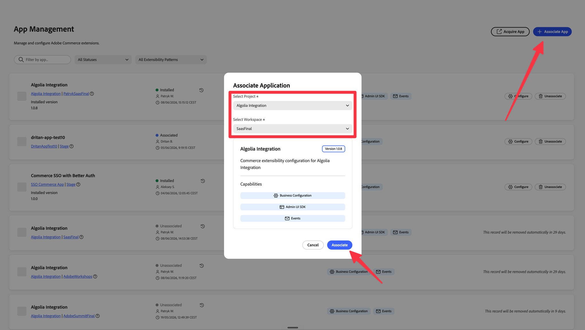
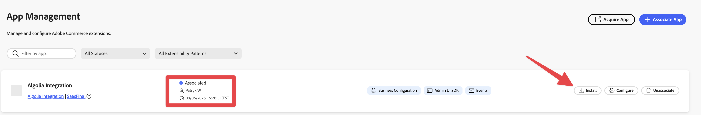

# 1. Installation & connecting your instance

This chapter covers getting the app into your organization and opening it on the Commerce instance you
want to connect to Algolia.

> **Prerequisites**
> - An Adobe organization with access to **Adobe Commerce as a Cloud Service (ACCS)** or a
>   **PaaS (on-premise / Adobe Commerce Cloud)** instance.
> - An **Algolia** account with an **Application ID** and an **Admin API Key**
>   (find them in the Algolia dashboard under **Settings → API Keys**).

---

## Step 1 — Install the app from Adobe Exchange

1. Go to **[exchange.adobe.com](https://exchange.adobe.com/)** and select **Experience Cloud**.
2. Search for **Algolia – App Builder Integration**.
3. Open the listing and click **Free** / **Install**, then follow the prompts.

After choosing the app, you need to create an **App Builder environment** where the app will be
deployed. This request will need to be approved by your admin. Once that's done, you will need to
associate the app to your PaaS or ACCS instance — see the next step.

---

## Step 2 — Associate the app with your Commerce instance

The application is installed once for your organization, but it is **associated and activated per
Commerce instance**. To connect it, you associate three things:

1. The **project** — **Algolia Integration**.
2. The **workspace** — the App Builder environment you created in Step 1.
3. The **Commerce instance** — your PaaS or ACCS instance.

Open the instance you want to connect to Algolia:

### On ACCS (SaaS)

1. Open the **Adobe Commerce as a Cloud Service** console.
2. Navigate to **App Management**.
3. Find **Algolia Integration** in the list of available applications and select it.
4. Select the **workspace** — the App Builder environment you created in Step 1.
5. Click **Associate** to link the app to this instance.

### On PaaS (on-premise / Adobe Commerce Cloud)

1. Sign in to your **Commerce Admin**.
2. Open **App Management** (the App Builder / extensibility section of the admin).
3. Select **Algolia Integration**.
4. Select the **workspace** — the App Builder environment you created in Step 1.
5. Click **Associate** to link the app to this instance.

---

## Step 3 — Install the app

With the app associated to your instance, click **Install**. Installing activates the integration on
this instance. Behind the scenes it:

- **Subscribes to Commerce events** for product and category create / update / delete (so changes flow
  to Algolia automatically).
- **Registers the Admin UI dashboard**, which adds a new menu item:
  **Apps → Algolia Configuration** in Commerce Admin.
- **Provisions the database** the integration uses for its processing queue and tracking
  (a one-time migration that creates the required collections and indexes).

Installation can take a short while. When it finishes, the **Algolia Configuration** menu item will be
available.

> ℹ️ **CMS pages.** Real-time CMS page events are intentionally **not** subscribed, because ACCS does not
> emit them. CMS page support is PaaS-only and handled through full sync. See
> [CMS pages](./07-cms-pages.md).

---

## What happens next

At this stage the app is **installed** on your instance, but not yet configured. Two things remain,
covered in the next chapters:

- **Configure your credentials** — click **Configure** to enter your Algolia **Application ID** and
  **Admin API Key**. See **[2. Configuring the app in App Management](./02-app-management-configuration.md)**.
- **Initialize the integration** — run the one-time setup from the **Algolia Admin UI dashboard**. See
  **[3. Initializing the dashboard](./03-initialization.md)**.

➡️ Continue to **[2. Configuring the app in App Management](./02-app-management-configuration.md)**.
