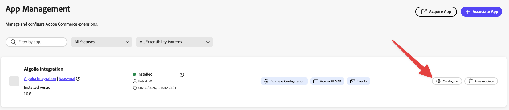
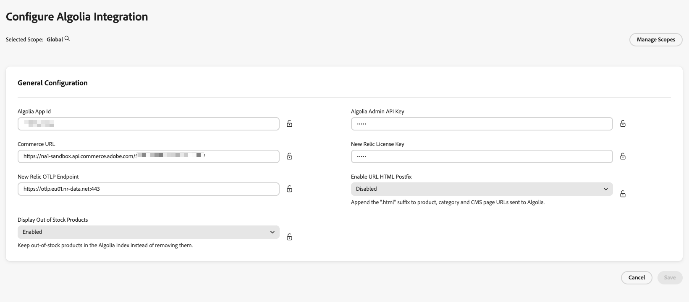

# 2. Configuring the app in App Management

After the app is installed (see [chapter 1](./01-installation.md)), it needs your **Algolia
credentials**, your **Commerce URL**, and a few optional settings before it can run. These live in
**App Management** inside Commerce Admin — *not* in the Algolia Configuration dashboard.

> **Why here?** Credentials and a handful of global flags are stored as **App Management business
> configuration**. Adobe resolves them securely at runtime and injects them into the integration — you
> never have to manage environment variables or secrets yourself.

---

## Step 1 — Open the configuration form

On the **App Management** view you'll see the **Algolia Integration** app, now associated and installed
on your instance (see [chapter 1](./01-installation.md)). Click the **Configure** button to open its
settings form.



---

## Step 2 — Fill in the settings

| Setting | Required | Description |
| ------- | :------: | ----------- |
| **Algolia App Id** | ✅ | Your Algolia **Application ID**. |
| **Algolia Admin API Key** | ✅ | Your Algolia **Admin API Key** (stored as a secret). |
| **Commerce URL** | ✅ | The base URL of your Commerce REST API. The format differs for PaaS vs SaaS — see below. |
| **New Relic License Key** | ⬜ | *(Optional)* Enables log & trace forwarding to New Relic. |
| **New Relic OTLP Endpoint** | ⬜ | *(Optional)* Defaults to `https://otlp.nr-data.net:4318`. |
| **Enable URL HTML Postfix** | ⬜ | Append the `.html` suffix to product, category, and CMS page URLs sent to Algolia. Default: **Disabled**. |
| **Display Out of Stock Products** | ⬜ | Keep out-of-stock products in the Algolia index instead of removing them. Default: **Disabled**. |
| **Adobe Commerce as a Cloud Service (SaaS)** | ⬜ | Enable when the Commerce backend is ACCS/SaaS. Switches product price/stock retrieval to the SaaS GraphQL API and disables CMS page index syncing. Set once at the **global** scope. Default: **Disabled**. |

### Commerce URL format

The **Commerce URL** must match your deployment type:

**PaaS (on-premise / Adobe Commerce Cloud)** — base site URL **with a `/rest/` suffix**:

```
https://<environment-name>.us-4.magentosite.cloud/rest/
```

**SaaS (ACCS)** — the REST endpoint provided by Adobe Commerce:

```
https://na1-sandbox.api.commerce.adobe.com/<tenant-id>/
```

Replace the placeholders with your real environment name or tenant ID. The integration **auto-detects**
PaaS vs SaaS from this URL.

> 💡 **Scopes & inheritance.** The two store-level boolean flags (*Enable URL HTML Postfix*, *Display Out of Stock
> Products*) are scope-aware. You can set them at **global**, **website**, **store**, or **store view**
> level, and lower scopes inherit from higher ones unless you override them. Pick the scope in App
> Management before editing the value. The *Adobe Commerce as a Cloud Service (SaaS)* flag is
> deployment-wide — set it once at the **global** scope.

> 📸 **Screenshot needed** — _App Management scope selector (global / website / store view)_
>
> 

---

## A note on Commerce authentication

You do **not** enter any Commerce username, password, or integration tokens here. The integration
authenticates to Commerce using **Adobe IMS (OAuth Server-to-Server)** credentials that Adobe injects
automatically — for **both** PaaS and SaaS.

**SaaS / ACCS:** nothing extra to do.

**PaaS only:** your Commerce instance must be set up to accept IMS tokens:

1. Configure the **Adobe Identity Management Service (IMS) integration** in Commerce Admin
   ([Adobe documentation](https://experienceleague.adobe.com/en/docs/commerce-admin/start/admin/ims/adobe-ims-config)).
2. Add the integration's **technical account email** (`<id>@techacct.adobe.com`) as an Admin user in
   Commerce under **System → Permissions → All Users**, and assign it a role with the required API
   permissions.

---

## Step 3 — Save

Once you've filled in the settings, **save** the configuration. The integration picks them up at
runtime — no redeploy needed.

➡️ Continue to **[3. Initializing the dashboard](./03-initialization.md)**.
