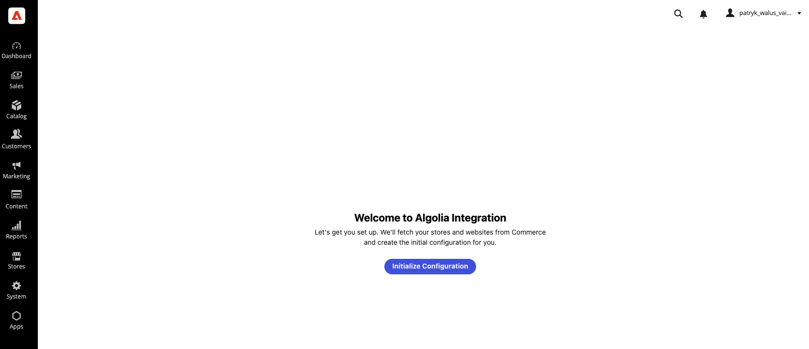

# 3. Initializing the dashboard

After the app is installed, you configure *how* your catalog is indexed in the **Algolia Configuration
dashboard**. The very first time you open it, you'll see a one-click **Initialization** screen.

---

## Step 1 — Open the Algolia Configuration dashboard

In **Commerce Admin**, open the menu added during installation:

**Apps → Algolia Configuration**

This works the same on ACCS and PaaS — the dashboard is embedded in the admin via the Adobe **Admin UI
SDK**.

> 📸 **Screenshot needed** — _Commerce Admin sidebar showing "Apps → Algolia Configuration"_
>
> 

---

## Step 2 — Run the one-click initialization

The first time the dashboard opens, it detects that no configuration exists yet and shows the
**Welcome / Initialization** screen instead of the settings tabs.

Click **Initialize Configuration**.

While it runs you'll see _"Fetching data from Commerce and saving configuration…"_. Initialization:

- **Reads your stores, websites, and store groups** from Commerce.
- **Creates a default configuration** for every store view (the `admin` store view is excluded):
  - A **store → website URL mapping**, with each store's URL defaulting to your Commerce base URL.
  - **Index mappings** for products, categories, and CMS pages, with a default index name of
    `<entity>_<store_code>` (for example `products_default`), all **enabled**.
  - **Empty Products and Categories configurations**, ready for you to add attributes, facets, sorting,
    and ranking.

When it finishes, the dashboard reveals its five tabs and you're ready to configure indexing.

> ✅ **Safe to retry.** Initialization is idempotent and only runs once. If it ever fails partway
> (for example, a temporary Commerce hiccup), just click the button again — it cannot overwrite work
> you've already done, because no edits are possible before setup completes.

---

## What you'll see next

Once initialized, the dashboard always opens straight to its tabbed interface:

| Tab | Purpose |
| --- | ------- |
| **Stores** | Map stores to Algolia indices and set store URLs — [chapter 4](./04-stores.md) |
| **Products** | Attributes, facets, sorting, ranking — [chapter 5](./05-products.md) |
| **Categories** | Attributes and ranking — [chapter 6](./06-categories.md) |
| **Full Sync** | Push config to Algolia & run manual syncs — [chapter 8](./08-full-sync.md) |
| **Queue Monitor** | Track sync operations — [chapter 9](./09-queue-monitor.md) |

➡️ Continue to **[4. Stores — index mapping & URLs](./04-stores.md)**.
