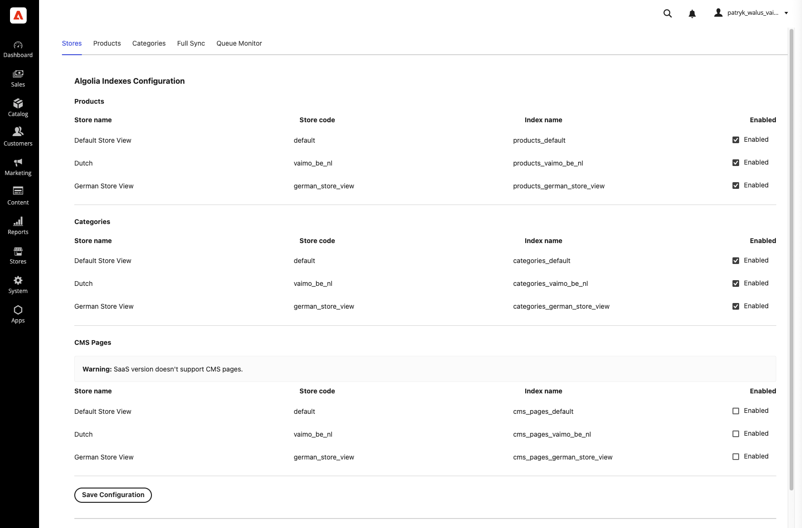
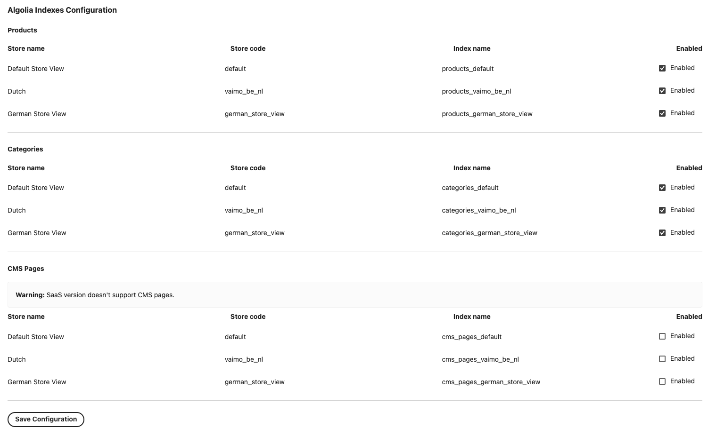
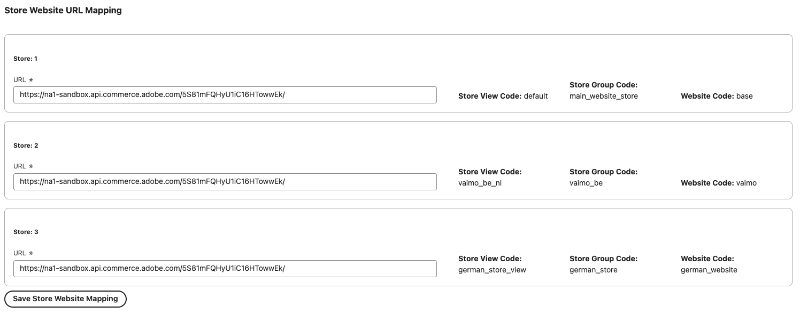

# 4. Stores — index mapping & URLs

The **Stores** tab is where you decide **which Algolia index** each store writes to, **whether** that
store syncs at all, and **what URL** is used when building product, category, and CMS page links.

This is usually the first tab you configure after [initialization](./03-initialization.md).

---

## Algolia Indexes Configuration

This section has three subsections — one per entity type. Each lets you set the **index name** and an
**Enabled** toggle **per store view**:

- **Products Index**
- **Categories Index**
- **CMS Pages Index** *(PaaS only — see [CMS pages](./07-cms-pages.md))*

For every store view you'll see:

| Field | Editable | Description |
| ----- | :------: | ----------- |
| Store name & store code | ❌ | Identifies the store view. |
| **Index name** | ✅ | The Algolia index this store writes to (e.g. `products_default`). Defaults to `<entity>_<store_code>`. |
| **Enabled** | ✅ | When unchecked, this store view is **not** synced for that entity type. |

---

## Store Website URL Mapping

Each store is mapped to a **website URL**. The integration uses this URL when constructing the absolute
product, category, and CMS page URLs it sends to Algolia, so links in your search results resolve to
the correct storefront.

| Field | Editable | Description |
| ----- | :------: | ----------- |
| Store View Code | ❌ | Read-only identifier. |
| Store Group Code | ❌ | Read-only identifier. |
| Website Code | ❌ | Read-only identifier. |
| **URL** | ✅ | The storefront base URL for this store. Defaults to your Commerce base URL. |

---

## After editing

Index name, enabled state, and URL changes take effect for **future** syncs. To populate or re-populate
an index after changing its mapping, run a sync from the [Full Sync](./08-full-sync.md) tab.

➡️ Continue to **[5. Products](./05-products.md)**.
