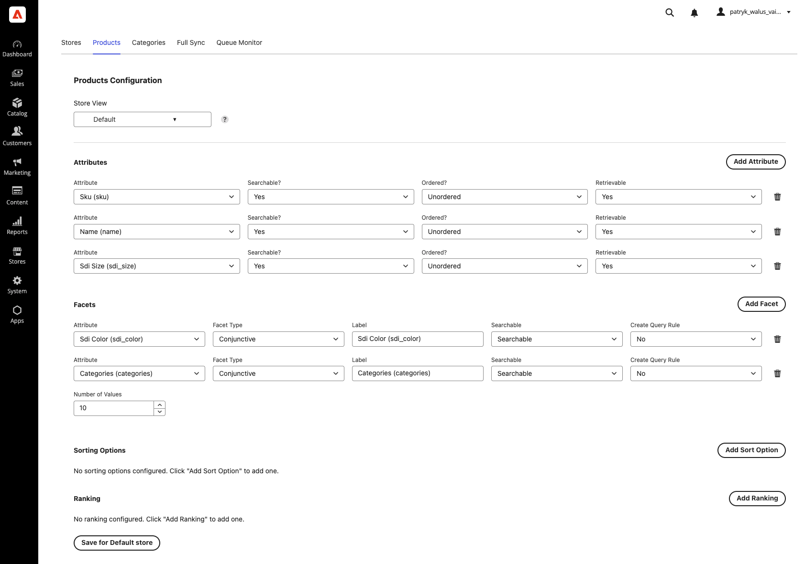
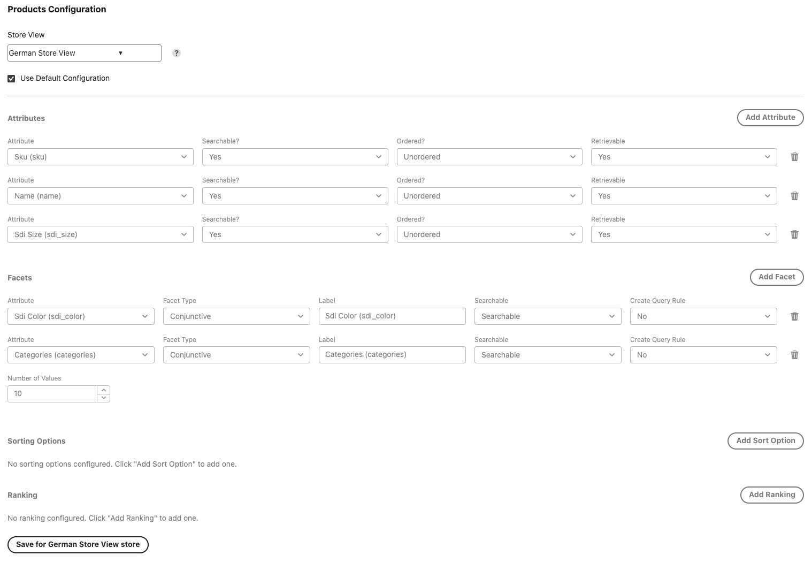
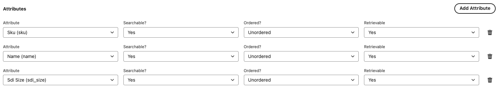
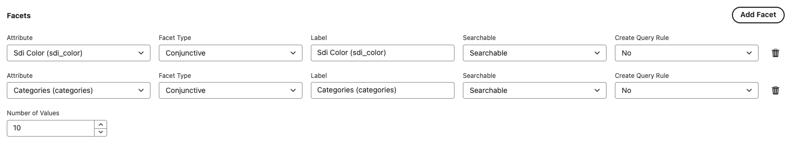
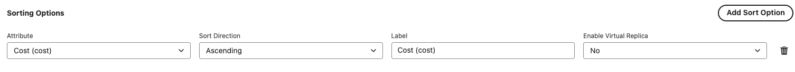
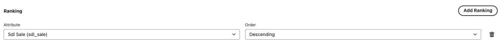

# 5. Products — attributes, facets, sorting & ranking

The **Products** tab controls how your products are indexed and searched in Algolia. It has four
sections: **Attributes**, **Facets**, **Sorting**, and **Ranking**.

---

## Per-store configuration (applies to Products & Categories)

At the top of the tab is a **Store View** selector. The way per-store settings work is the same on both
the Products and Categories tabs:

- **Default** — the baseline configuration that applies to every store view unless overridden.
- **A specific store view** — shows a **Use Default Configuration** checkbox:
  - **Checked** (default for new stores): the store inherits the **Default** settings. The fields are
    shown dimmed and read-only.
  - **Unchecked**: you can customize settings just for that store view.
- Each section is saved with the **Save for `<store>` store** button. Saving the **Default** config also
  updates every store view that is currently set to *Use Default Configuration*.

> 💡 The Store View selector's tooltip reads _"Select a scope where settings will be applied."_ Always
> confirm you have the right store selected before editing.

---

## 1. Attributes Configuration

Determines which product attributes are sent to Algolia and how they behave. For each attribute you can
set:

| Option | Meaning |
| ------ | ------- |
| **Searchable** | Whether the attribute is searched against. |
| **Ordered** | Whether word order matters for this attribute (**Ordered**) or not (**Unordered**). |
| **Retrievable** | Whether the attribute is returned in search results. |

**Recommendations**

- ✅ Include descriptive attributes (`name`, `description`, `brand`) and identifiers (`SKU`, model numbers).
- ❌ Exclude display-only data (`URLs`, `images`, `prices`) and internal flags from *searchable*.

> 📸 **Screenshot needed** — _Products → Attributes Configuration_
>
> 

---

## 2. Facets Configuration

Facets are the filters shoppers use to narrow results (brand, color, price, …). For each facet:

| Option | Meaning |
| ------ | ------- |
| **Attribute** | The product attribute used as a facet. |
| **Facet Type** | **Price Range**, **Conjunctive** (AND), **Disjunctive** (OR), or **Slider**. |
| **Label** | Display name shown on the storefront. |
| **Searchable** | **Searchable**, **Filter Only**, or **Not Searchable**. |
| **Create Query Rule** | **Yes** / **No**. |
| **Number of Values** | Maximum number of facet values to display. |

---

## 3. Sorting Configuration

Custom sort options for product listings (e.g. "Price: low to high"). For each option:

| Option | Meaning |
| ------ | ------- |
| **Attribute** | The product attribute to sort by. |
| **Sort Direction** | **Ascending** or **Descending**. |
| **Label** | Display name for the sort option. |
| **Enable Virtual Replica** | **Yes** / **No** — creates an Algolia virtual replica for this sort order. |

---

## 4. Ranking Configuration

Custom ranking rules surface your best products. Algolia applies these as a **tie-breaker** after its
default ranking. For each rule:

| Option | Meaning |
| ------ | ------- |
| **Attribute** | The product attribute to rank by. |
| **Order** | **Ascending** or **Descending**. |

---

## ⚠️ Don't forget to push the configuration

Changes you make here describe **Algolia index settings** (searchable attributes, faceting, replicas,
custom ranking). They are **not** applied to Algolia until you click **Sync Indexes Configuration With
Algolia** on the [Full Sync](./08-full-sync.md) tab.

> **Save → then Sync.** Saving stores your configuration in the app; **Sync Indexes Configuration With
> Algolia** pushes it to your Algolia indices. Do both. See
> [Working with the app](./11-working-with-the-app.md).

➡️ Continue to **[6. Categories](./06-categories.md)**.
