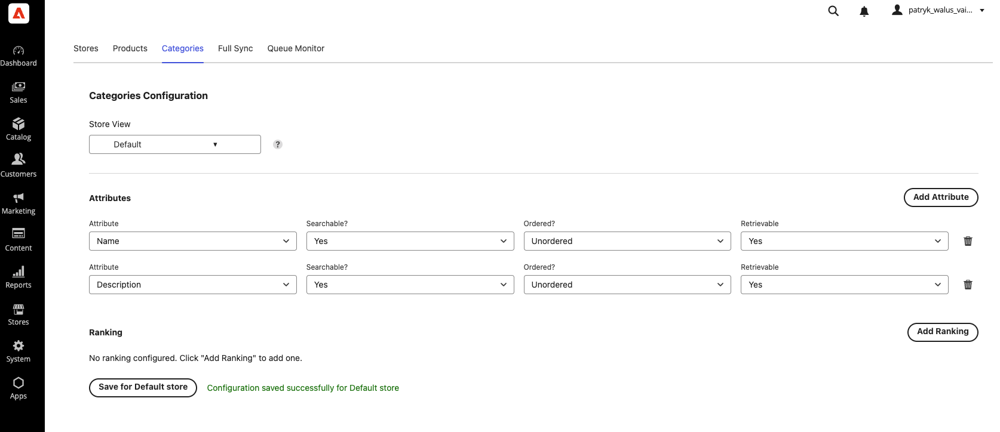
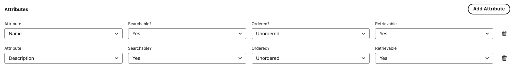
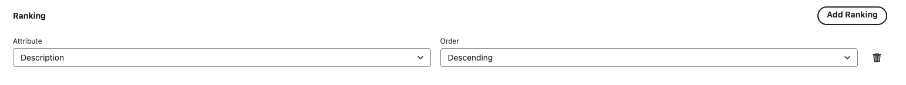

# 6. Categories — attributes & ranking

The **Categories** tab controls how categories are indexed and ranked in Algolia. It has two sections:
**Attributes** and **Ranking**.

Per-store configuration works exactly as on the Products tab — a **Store View** selector with a **Use
Default Configuration** checkbox for each store view, and a **Save for `<store>` store** button. See
[Products → Per-store configuration](./05-products.md#per-store-configuration-applies-to-products--categories)
for the full explanation.

---

## 1. Attributes Configuration

Determines which category attributes are sent to Algolia and how they behave. For each attribute:

| Option | Meaning |
| ------ | ------- |
| **Searchable** | Whether the attribute is searched against. |
| **Ordered** | Whether the attribute is used for sorting (Unordered / Ordered). |
| **Retrievable** | Whether the attribute is returned in search results. |

---

## 2. Ranking Configuration

Custom ranking rules for categories. For each rule:

| Option | Meaning |
| ------ | ------- |
| **Attribute** | The category attribute to rank by. |
| **Order** | **Ascending** or **Descending**. |

---

## ⚠️ Don't forget to push the configuration

As with products, category attribute and ranking changes only reach Algolia after you click **Sync
Indexes Configuration With Algolia** on the [Full Sync](./08-full-sync.md) tab.

➡️ Continue to **[7. CMS pages](./07-cms-pages.md)**.
