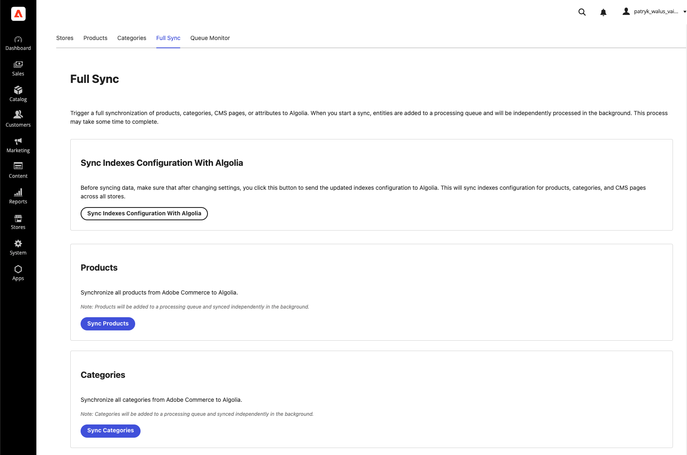
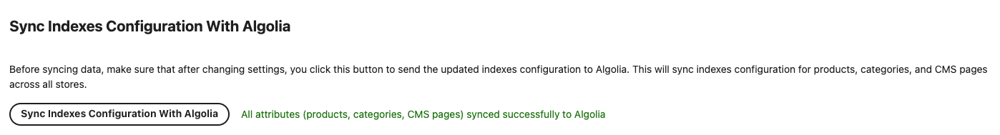
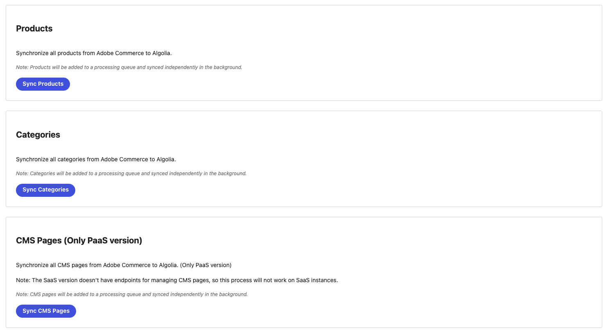

# 8. Full Sync — pushing config & syncing data

The **Full Sync** tab is your control panel for two distinct things:

1. **Pushing your index *configuration*** (attributes, facets, sorting, ranking) to Algolia.
2. **Synchronizing your *data*** (products, categories, CMS pages) and the **attribute option cache** to
   Algolia, on demand.

---

## Sync Indexes Configuration With Algolia

> 🔑 **This is the most important button to remember.**

Whenever you change settings on the **Products** or **Categories** tabs — attributes, facets, sorting,
or ranking — those changes are saved in the app but **not yet applied to Algolia**. Click **Sync Indexes
Configuration With Algolia** to push the updated index settings to Algolia for **all entity types across
all stores**.

**Click this after every settings change.** If you skip it, your storefront search will keep using the
old facets, ranking, and sorting.

---

## Data sync buttons

The remaining buttons trigger a **full re-synchronization** of an entity type. Products, categories, and
CMS pages are added to a **processing queue** and synced **in the background** — the button returns
quickly with _"Entities queued successfully. Processing will continue in the background."_ Track
progress on the [Queue Monitor](./09-queue-monitor.md) tab.

| Button | What it does | Queued? |
| ------ | ------------ | :-----: |
| **Sync Products** | Re-syncs all products from Commerce to Algolia, and cleans up orphans. | ✅ Background queue |
| **Sync Categories** | Re-syncs all categories from Commerce to Algolia, and cleans up orphans. | ✅ Background queue |
| **Sync CMS Pages** *(PaaS only)* | Re-syncs all CMS pages. Has no effect on SaaS/ACCS — see [CMS pages](./07-cms-pages.md). | ✅ Background queue |
| **Sync Attributes** | Refreshes the cached **select / multi-select option labels** (see below). | ⚡ Immediate, no queue |

---

## About "Sync Attributes" — the option-label cache

This is **different** from *Sync Indexes Configuration*. Products store **select** and **multi-select**
attribute values as option IDs; to index them as human-readable text, the app keeps a **cache of each
option's label**. **Sync Attributes** rebuilds that cache from Commerce.

**You must run Sync Attributes whenever you add, rename, or remove options** on a select / multi-select
attribute (for example, adding a new color or size). Otherwise products may be indexed with missing or
outdated option labels. This sync runs **immediately** (it does not go through the queue).

> ✅ A scheduled job also refreshes this cache automatically **every hour** (on the hour, UTC), so the
> cache will catch up on its own within the hour — but run it manually when you need the change reflected
> right away. See [How synchronization works](./10-how-synchronization-works.md).

---

## Automatic schedules

You rarely need the buttons above for routine upkeep — scheduled jobs run the same syncs on a cron
schedule (all times **UTC**):

| Job | Schedule | Cron | What runs |
| --- | -------- | ---- | --------- |
| **Full data sync** | Daily at **03:00 UTC** | `0 3 * * *` | Re-syncs all **products**, **categories**, and **CMS pages** (PaaS) — the scheduled equivalent of the *Sync Products / Categories / CMS Pages* buttons. |
| **Attribute option cache** | **Hourly**, on the hour | `0 * * * *` | Refreshes the select / multi-select **option-label cache** — the scheduled equivalent of *Sync Attributes*. |

> ℹ️ Between these full reconciliations, **Commerce events** keep Algolia current in near-real time, and
> the queue is processed **every 5 minutes**. See [How synchronization works](./10-how-synchronization-works.md).

---

## When should you run a manual full sync?

- **First-time setup**, to populate your indices for the first time.
- After a **large catalog import** or bulk change.
- After changing **index ↔ store mapping** on the [Stores](./04-stores.md) tab.
- After **adding / changing select / multi-select options** → run **Sync Attributes**.
- After changing **attributes, facets, sorting, or ranking** → click **Sync Indexes Configuration With
  Algolia** (and re-sync data if needed).

For routine, ongoing changes you usually **don't** need to run a full sync — Commerce events keep Algolia
current automatically, the daily 03:00 UTC full sync reconciles products/categories/CMS pages, and the
hourly job keeps the attribute option-label cache fresh (see [Automatic schedules](#automatic-schedules)).

➡️ Continue to **[9. Queue Monitor](./09-queue-monitor.md)**.
