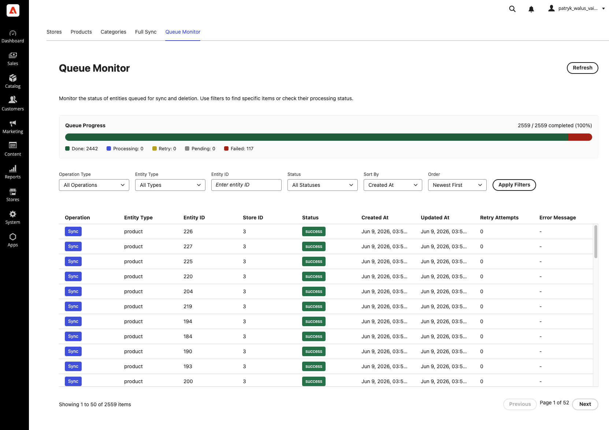

# 9. Queue Monitor — tracking sync status

Every product, category, and CMS page synchronization — whether triggered by a Commerce event, a manual
full sync, or the nightly job — passes through a **processing queue**. The **Queue Monitor** tab lets you
inspect that queue so you can see **what is syncing, what succeeded, and what failed**.

---

## Filters

Use the filters at the top to narrow the list:

| Filter | Options |
| ------ | ------- |
| **Entity Type** | All Types, Product, Category, CMS Page |
| **Entity ID** | Search for a specific entity by ID |
| **Status** | All Statuses, Pending, Processing, Success, Failed, Retry |
| **Sort By** | Created At or Updated At |
| **Order** | Newest First or Oldest First |

---

## The queue table

Each row is one entity being synced for one store. Columns:

| Column | Description |
| ------ | ----------- |
| **Entity Type** | Product, Category, or CMS Page. |
| **Entity ID** | The Commerce ID of the entity. |
| **Store ID** | The store view the operation applies to. |
| **Status** | Colour-coded — see below. |
| **Created At** | When the item entered the queue. |
| **Updated At** | When it was last updated. |
| **Retry Attempts** | How many times processing has been retried. |
| **Error Message** | For failures — click to view the full message in a modal. |

The table is **paginated (50 items per page)** and has a manual **refresh** button.

### Status colours

| Status | Colour | Meaning |
| ------ | ------ | ------- |
| **Success** | 🟢 Green | Completed successfully. |
| **Failed** | 🔴 Red | Failed after the maximum retry attempts. |
| **Processing** | 🔵 Blue | Currently being processed. |
| **Retry** | 🟡 Yellow | Scheduled to be retried. |
| **Pending** | ⚪ Gray | Waiting to be processed. |

---

## How to read it

- **Lots of Pending / Processing right after a full sync?** That's normal — items are worked through in
  the background. Refresh periodically; they should move to **Success**.
- **A few Retry rows?** Usually transient (a momentary Commerce or Algolia hiccup). The app retries
  automatically — up to 5 times — before marking an item **Failed**.
- **Failed rows?** Click the **Error Message** to see why. See [Troubleshooting](./12-troubleshooting.md).

> 🧹 The queue is **self-cleaning**: completed (**Success**) rows are pruned after 7 days and **Failed**
> rows after 30 days by a nightly job, so the monitor stays fast. See
> [How synchronization works](./10-how-synchronization-works.md).

➡️ Continue to **[10. How synchronization works](./10-how-synchronization-works.md)**.
